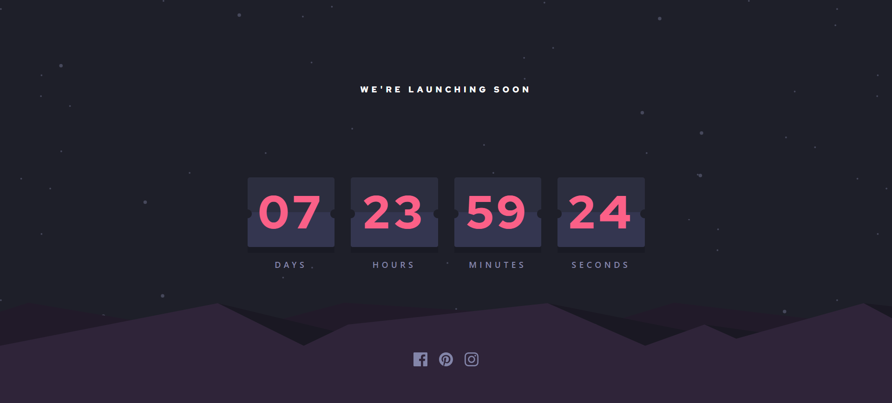

# Frontend Mentor - Launch countdown timer solution

This is a solution to the [Launch countdown timer challenge on Frontend Mentor](https://www.frontendmentor.io/challenges/launch-countdown-timer-N0XkGfyz-). Frontend Mentor challenges help you improve your coding skills by building realistic projects.

## Table of contents

- [Overview](#overview)
  - [The challenge](#the-challenge)
  - [Screenshot](#screenshot)
  - [Links](#links)
- [My process](#my-process)
  - [Built with](#built-with)
  - [What I learned](#what-i-learned)
  - [Useful resources](#useful-resources)
- [Author](#author)

## Overview

### The challenge

Users should be able to:

- See hover states for all interactive elements on the page
- See a live countdown timer that ticks down every second (start the count at 14 days)
- **Bonus**: When a number changes, make the card flip from the middle

### Screenshot

### Links

- Solution URL: [https://github.com/KarimAyman97/count-down--launch]
- Live Site URL: [https://count-down-launch.vercel.app/]

## My process

### Built with

- [Next.js](https://nextjs.org/) - React framework
- [tailwindcss](https://tailwindcss.com/) - A utility-first CSS framework
- CSS custom properties

### What I learned

I knew how to make flip cards using tailwind and css also i learnt how can i conert Date to days , hours , minutes and seconds with help of css modules feature in nextjs

### Useful resources

- [GitHub Repo](https://github.com/fvaldes0109/FM-launch-countdown-timer) - This Helped me to display he remaining time in proper way
- [Youtube Video](https://www.youtube.com/watch?v=p_6IuhmBsfc&t=2s) - This Video Helped me Really to make the flip cards and to understand how it works .

## Author

- _Github_ - [@karim_Ayman](https://github.com/KarimAyman97)
- _Frontend Mentor_ - [@Karim_Ayman](https://www.frontendmentor.io/profile/KarimAyman97)
- _LinkedIn_ - [@karimAyman](https://www.linkedin.com/in/karimayman97/)
